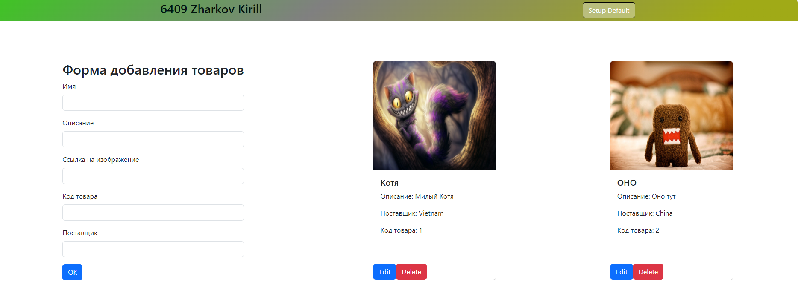
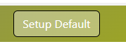
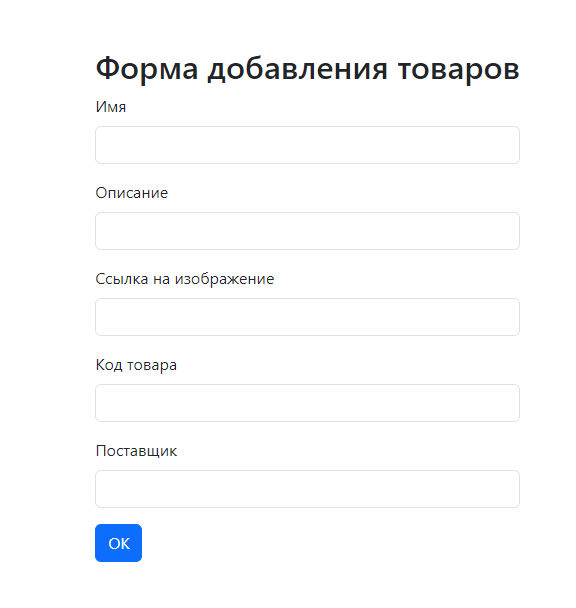
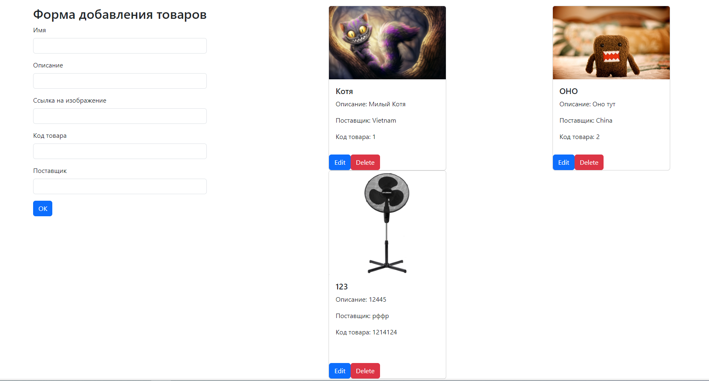

В данном файле представлено описание функционала веб приложения админ карточек.
Визуал

в шапке слева можно заметить кнопку "Setup Default", которая возвращает страницу к изначальному значению.

Слева в центре экрана видно поле для заполнения. Заполним поля и нажмем на кнопку.  

Можно наблюдать, что новая карточка добавилась. Можно отредактировать, например, имя.

